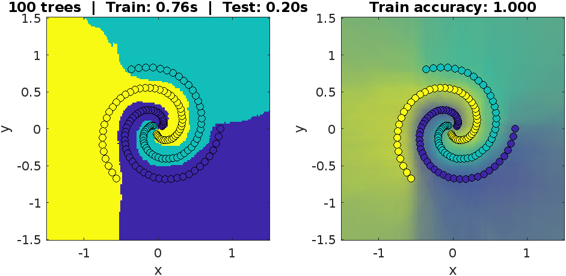

# Random Forest for Matlab 🌲🌳🌴🎄🎋

forked from [karpathy/Random-Forest-Matlab](https://github.com/karpathy/Random-Forest-Matlab)



This toolbox was written for education purposes by Andrej Karpathy.
It is NOT intended for any serious applications and it does not NOT do many of things you would
want a mature implementation to do, like leaf pruning. 


---------------------------------------------------------------------------
Usage:

Random Forests for classification: (see demo for more)
```matlab
opts.classfierID= [2, 3]; % use both 2D-linear weak learners (2) and conic (3)
m= forestTrain(X, Y, opts);
yhat = forestTest(m, X);
fprintf('Training accuracy = %.2f\n', mean(yhat==Y));
```

---------------------------------------------------------------------------
More info:

Currently contains random forests.
The Random Forest code is not industrial strength implementation.

Inspired by MSR's recent work on Random Forests:
https://research.microsoft.com/apps/pubs/default.aspx?id=155552

See http://cs.stanford.edu/~karpathy/randomForestSpiral.png
for results on spiral using 2-D linear weak learners. (Code that generates
the image is in forestdemo.m) 

---------------------------------------------------------------------------
Adding your own weak learners in Ranfom Forests:

It is fairly easy to add your own weak learners. Modify:
weakTrain.m:  add another elseif statement for classf variable, and put in
              code for your weak learner. Store all variables you need during
              test time in modelCandidate
weakTest.m:   add another elseif for your classifier, and implement the decision
              procedure, using variables you stored inside model.
Now just include your new classifier when setting opts.classfierID!
---------------------------------------------------------------------------

BSD Licence. 

